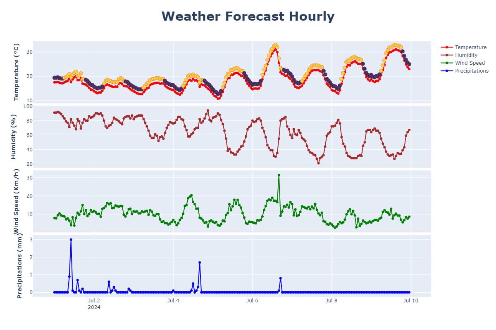
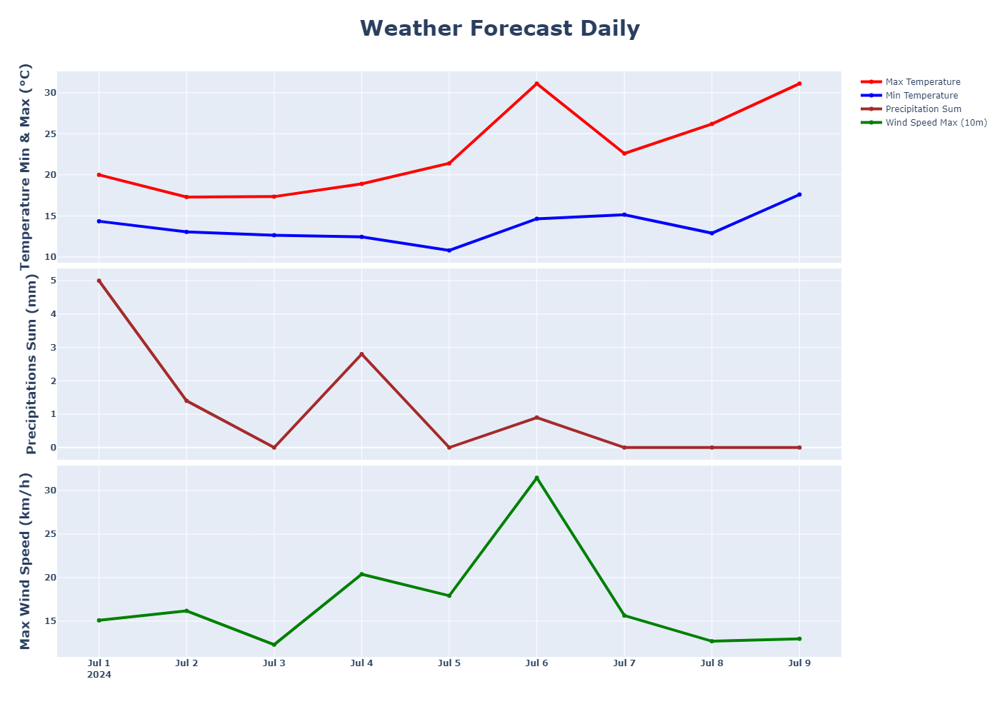
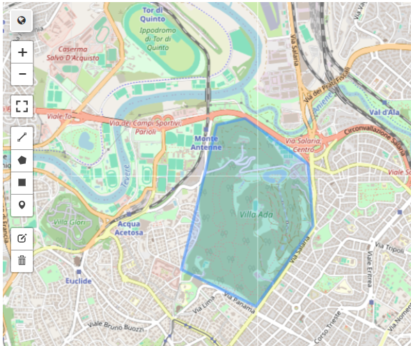
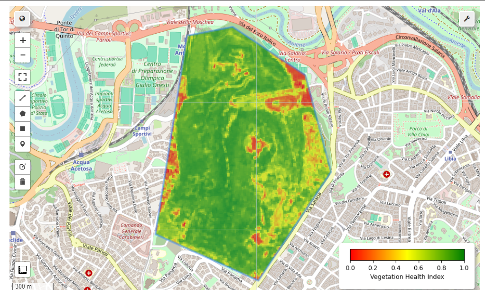
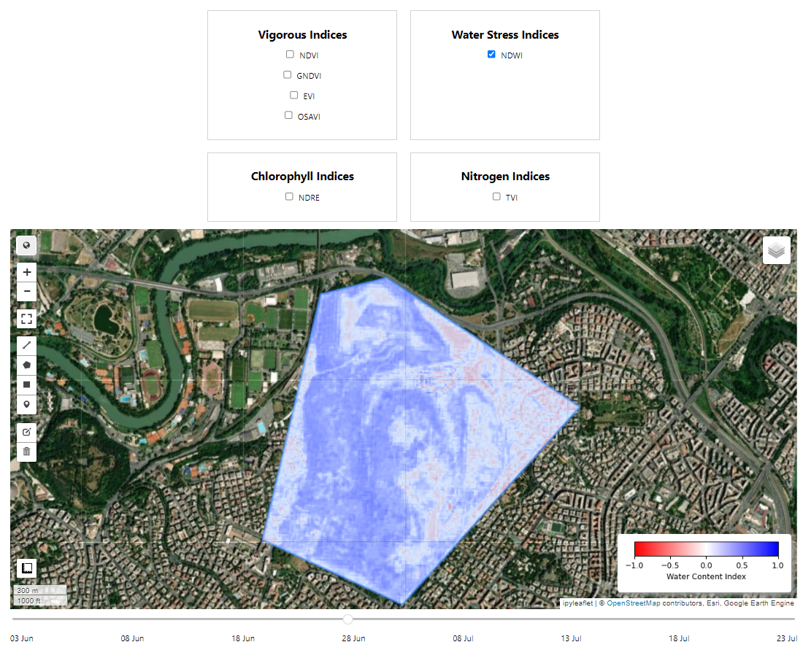

# AgroEye
AgroEye is an innovative project focused on leveraging computer vision technology to enhance precision agriculture. By using advanced image processing and machine learning algorithms, AgroEye aims to provide farmers with real-time insights into their crops' health, growth patterns, and potential issues.
 
## Code directory
 
```
└── `AgroEye`
    ├── `conda`: conda environments
    ├── `images`: All the images, if any
    ├── `notebooks`: All notebooks such as Jupyter notebooks, if any
    ├── `papers`: All the papers used to conduct the crop analysis
    ├── `src`: Python code for the app
    ├── `tests`: performance, unit and end-to-end tests
    ├── `.gitignore`
    └── `README.md`
```


## Historical Weather Data Acquisition

### Overview

The acquisition of historical weather data is the first step in conducting smart analysis on crop fields. Weather data can be correlated with satellite and drone image information to provide a comprehensive understanding of crop health and growth patterns.

### Data Collection

Currently, we obtain historical weather information for two specified dates. This data includes key weather parameters such as temperature, humidity, wind speed and total precipitation collected on both a daily and hourly basis.

### Visualizations

#### Hourly Weather Information Plot

The following plot displays the hourly temperature, humidity, wind speed and total precipitation from the specified dates:




#### Hourly Weather Information Plot

The following plot displays the daily min and max temperature, humidity, wind speed and total precipitation from the specified dates:




## Calculate Crop Metrics from Sentinel-2 Images with Python API
 
Before computing the crop analysis is necessary to acuquire the satellite images. First of all the user must insert an existing valid address (otherwise we cannot conduct the analysis), for exaple "*Rome, Italy*" in the geocoding function, which outputs the latitude and longitude of the address. Thanks to those informaiton is possible to instanciate a `geemap.Map` object, which will be our base for the identification of the field, on which the analysis we'll be carried out. 

Once the Map is created, it is necessary to create a Polygon inside the map, using the predefined widget in the left panel of the Map:



The user can create as many Polygon as she wants. All the Polygons we'll be the crops, on which the analysis we'll be condcuted. Now is it possible to acquire the satellite images from *Sentinel-2*.

```
# Filter Sentinel-2 image collection
try:
    sentinel_images = (
        ee.ImageCollection("COPERNICUS/S2_SR_HARMONIZED")
        .filterDate(start_date, end_date)
        .filterBounds(combined_geometry)
        .filter(ee.Filter.lt("CLOUDY_PIXEL_PERCENTAGE", 20))
    )
    print("Sentinel-2 images acquired correctly!")

except Exception as e:
    print("An error occurred while trying to acquire the Sentinel-2 images.")
    print(f"Error: {e}")
```

With the images correclty acquired (filtered by the `"CLOUDY_PIXEL_PERCENTAGE"`, in order to keep only noiseless information), is it possible to compute to compute all the crop metrics.


# Vegetation Indices for Sentinel-2 Imagery Analysis

These indices are categorized based on what they calculate:

## 1. Vigorous Index

### Normalized Difference Vegetation Index (NDVI)
**Description:** NDVI is used to measure and monitor plant growth, vegetation cover, and biomass production.
**Formula:**
$$\text{NDVI} = \frac{\text{NIR} - \text{Red}}{\text{NIR} + \text{Red}}$$
**Bands Used:** NIR (B8), Red (B4)

The figure below show an example of NDVI index, computed for the Polygon of interest. 



### Green Normalized Difference Vegetation Index (GNDVI)
**Description:** GNDVI is used to assess vegetation health, similar to NDVI, but uses the green band instead of the red band.
**Formula:**
$$\text{GNDVI} = \frac{\text{NIR} - \text{Green}}{\text{NIR} + \text{Green}}$$
**Bands Used:** NIR (B8), Green (B3)

### Optimized Soil Adjusted Vegetation Index (OSAVI)
**Description:** OSAVI is an optimized version of SAVI designed to minimize soil brightness influences in areas of sparse vegetation.
**Formula:**
$$\text{OSAVI} = \frac{\text{NIR} - \text{Red}}{\text{NIR} + \text{Red} + 0.16}$$
**Bands Used:** NIR (B8), Red (B4)

### Enhanced Vegetation Index (EVI)
**Description:** EVI is designed to enhance the vegetation signal with improved sensitivity in high biomass regions and better vegetation monitoring by minimizing soil and atmospheric influences.
**Formula:**
$$\text{EVI} = 2.5 \times \frac{\text{NIR} - \text{Red}}{\text{NIR} + 6 \times \text{Red} - 7.5 \times \text{Blue} + 1}$$
**Bands Used:** NIR (B8), Red (B4), Blue (B2)

## 2. Water Stress Index

### Normalized Difference Water Index (NDWI)
**Description:** NDWI is used to monitor changes in water content of leaves and to identify water bodies.
**Formula:**
$$\text{NDWI} = \frac{\text{Green} - \text{NIR}}{\text{Green} + \text{NIR}}$$
**Bands Used:** Green (B3), NIR (B8)

## 3. Chlorophyll Level

### Normalized Difference Red Edge Index (NDRE)
**Description:** NDRE is used to measure the plant chlorophyll content, differentiating between healthy and stressed vegetation.
**Formula:**
$$\text{NDRE} = \frac{\text{NIR} - \text{Red Edge}}{\text{NIR} + \text{Red Edge}}$$
**Bands Used:** NIR (B8), Red Edge (B5)

## 4. Nitrogen Stress

### Triangular Vegetation Index (TVI)
**Description:** TVI measures the area of a hypothetical triangle formed by the green peak, red minimum reflectance, and near-infrared shoulder. It is sensitive to leaf chlorophyll content and can be used for nitrogen stress detection in plants.
**Formula:**
$$\text{TVI} = 0.5 \times [120 \times (NIR - G)-200 \times (R-G)]$$


## Interactivity and Visualization
AgroEye provides an interactive web application that allows users to select two dates and interact with a geemap.Map object. The application includes various checkboxes and a date slider, giving users the ability to conduct crop analysis using the defined vegetation indices.

The figure below show an example of the Map showed to the users. With the NDWI index activated, computed for the Polygon of interest for the date **2024-06-28**.


 
## Contacts
**Build:** (mauo.andretta222@gmail.com)
 
**Ownership:** (mauo.andretta222@gmail.com)
 
**Maintenance:** 
Support & Ops (mauo.andretta222@gmail.com)

Feel free to contribute to the project!
